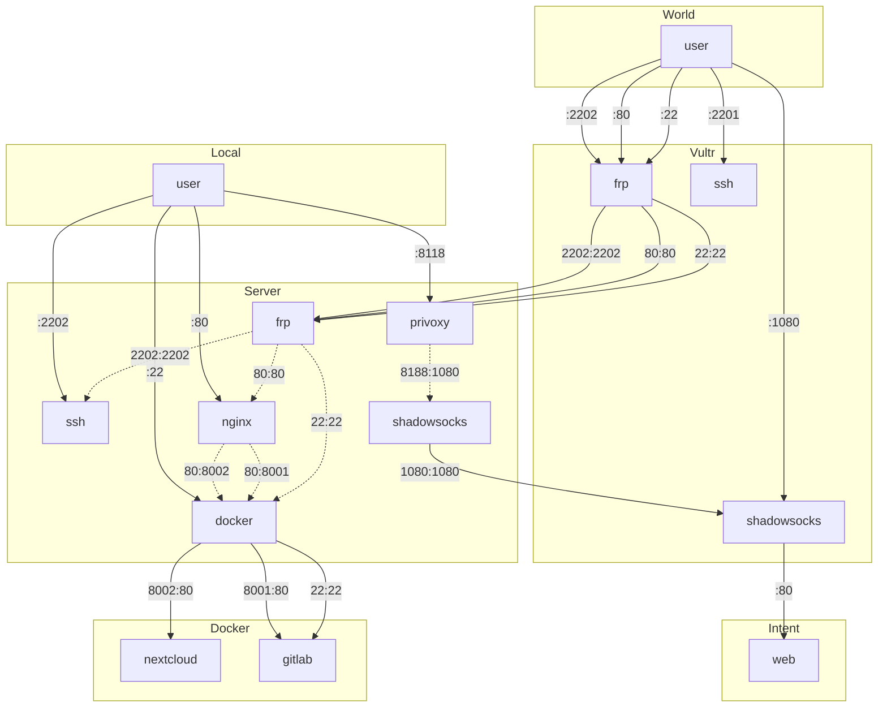

# 网络结构图

实线箭头：跨设备建立传输通道
虚线箭头：本设备内部中转

```mermaid
graph TB

subgraph Intent
web[web]
end

subgraph Docker
nextcloud[nextcloud]
end

subgraph Docker
gitlab[gitlab]
end

subgraph Server
frps[frp]
sshs[ssh]
nginx[nginx]
docker[docker]
shadowsockss[shadowsocks]
privoxy[privoxy]

frps -.-> |22:22|docker
frps -.-> |80:80| nginx
frps -.-> |2202:2202| sshs

nginx -.-> |80:8001|docker
nginx -.-> |80:8002|docker

privoxy -.-> |8188:1080| shadowsockss
end

subgraph Vultr
frpv[frp]
sshv[ssh]
shadowsocksv[shadowsocks]
end

subgraph Local
userl[user]
end

subgraph World
userw[user]
end

userw --> |:22| frpv
userw --> |:80| frpv
userw --> |:2202| frpv
userw --> |:2201| sshv

frpv --> |22:22| frps
frpv --> |80:80| frps
frpv --> |2202:2202| frps

userl --> |:22| docker
userl --> |:80| nginx
userl --> |:2202| sshs

docker --> |22:22|gitlab
docker --> |8001:80|gitlab
docker --> |8002:80|nextcloud

userl --> |:8118| privoxy
shadowsockss --> |1080:1080| shadowsocksv

userw --> |:1080| shadowsocksv
shadowsocksv --> |:80| web
```

Server系统

1. dnsmansp
2. shadowsocks
3. privoxy
4. frp
5. ssh
6. nginx
7. docker
8. gitlab
9. nextcloud